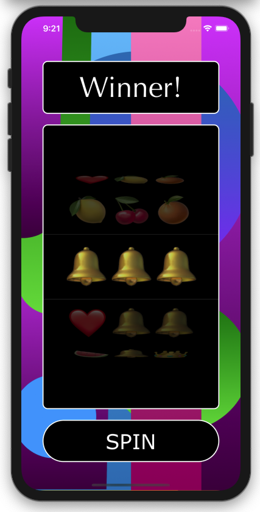

# EmojiSlotMachine

Slot Machine that uses emojis.

**Features:** 
- Win with 3 emojis in a row.
- Includes sound effects.

*Screenshot (in Dark mode)* \

**Inspired By:** \
[Allen Wong's Emoji Slot Machine ](https://github.com/allenwong/30DaysofSwift/blob/master/Project%2014%20-%20EmojiSlotMachine/emoji%20spin.gif) \

**Technical Info:** \
Xcode 11 project written in Swift 5 for iOS\
pickerview, randomization, AVAudioPlayer, cornerRadius\
traitCollectionDidChange, userInterfaceStyle, UIView.animate

**See Also:** \
[Quickies - a variety of example iOS apps](https://github.com/PepperoniJoe/Quickies)\
 [Make Icons Swiftly - used to generate app icon sets
 ](https://github.com/PepperoniJoe/Make-Icons-Swiftly)

**Author:** \
Marcy Vernon [@MarcyVernon](https://twitter.com/MarcyVernon)

**License:** \
"Emoji Slot Machine" is under the MIT license. See [LICENSE](/LICENSE) for more information.
