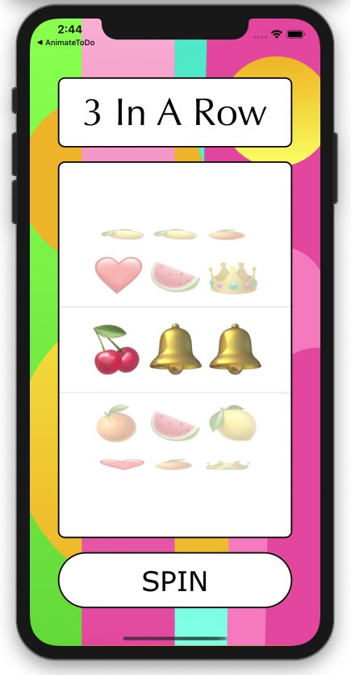

# EmojiSlotMachine
Slot Machine that uses emojis.

**Features:** 
- Win with 3 emojis in a row.
- Includes sound effects.

*Winner* \

**Technical Info:** \
Xcode 11 project written in Swift 5 for iOS

**Installations:**
1. Open project in Xcode
2. Go to project settings for the target and update the your signing information(signing and capabilities)
3. Build and run the app in Xcode. 

**Author:** \
Marcy Vernon [@MarcyVernon](https://twitter.com/MarcyVernon)

**License:** \
"Emoji Slot Machine" is under the MIT license. See [LICENSE](/LICENSE) for more information.
